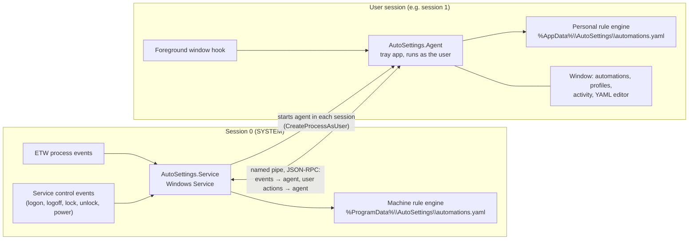

# Architecture

## Why two processes?

Windows puts services in **session 0**, isolated from users' desktops. A service is the only way to start with the
computer, see every sign-in and watch every process, but it **cannot** see which window has focus, and it cannot
change per-user settings (theme, wallpaper, default audio device, ...) because those live in the signed-in user's
registry hive and session.

So AutoSettings has two processes:

| Component | Project | Runs as | Responsibilities |
|---|---|---|---|
| **Core** | `src/AutoSettings.Core` (net10.0, no Windows APIs) | library | Configuration model, YAML reader/writer, validation, component catalog, JSON Schema, rule engine, profile manager, IPC contracts, editing model (`Editing/`: document operations, merge/import/export, templates, YAML autocomplete) |
| **Platform** | `src/AutoSettings.Platform` (net10.0-windows) | library | Win32/WinRT interop, process/focus monitors, session helpers, all action and condition handlers |
| **Service** | `src/AutoSettings.Service` | SYSTEM, session 0 | Boot/sign-in/lock/process events, machine automations, agent supervision, pipe server, routing of user actions, updates (`UpdateService`) |
| **Agent** | `src/AutoSettings.Agent` (WPF) | the user | Focus events, personal automations, tray icon, window (WPF-UI), visual and YAML editors (AvalonEdit), localization, notifications |
| **DocGen** | `src/AutoSettings.DocGen` | tool | Generates `docs/reference` and the JSON Schema from the catalog |
| **Tests** | `tests/AutoSettings.Core.Tests` | tool | Unit tests for Core; validates every example and every catalog entry |

## Event flow

Where each of the six requested triggers comes from:

| Trigger | Detected by | How |
|---|---|---|
| Computer boot | Service | At service start, the boot time (`now - TickCount64`) is compared with the one stored in `%ProgramData%\AutoSettings\last-boot.txt`; a new boot time means a new boot. Fast Startup boots are a resume from hibernation for session 0: on `PBT_APMRESUMEAUTOMATIC` the service reads the latest *Kernel-Boot* event 27 (boot type 1 = Fast Startup). |
| User logon (with the user) | Service | `OnSessionChange(SessionLogon)` of the Windows Service; user name, domain and SID via `WTSQuerySessionInformation` + `NTAccount.Translate`; RDP vs console via `WTSClientProtocolType`. |
| App started | Service | ETW real-time session on *Microsoft-Windows-Kernel-Process* (event 1). Falls back to WMI `Win32_ProcessStartTrace`, then to polling. Session id comes with the event. |
| App closed | Service | Same provider, event 2. The process's details are remembered from its start. |
| Focused on app | Agent | `SetWinEventHook(EVENT_SYSTEM_FOREGROUND)`, debounced 250 ms, compared by executable path so switching windows of the same app is not a change. |
| App no longer in focus | Agent | Same hook: when the foreground app changes, *unfocused* is raised for the previous app, then *focused* for the new one. |

Lock/unlock/logoff come from `OnSessionChange` too.

The service turns each notification into a `SystemEvent` and:

1. posts it to the **machine engine**;
2. forwards session and app events to the **agent of that session**, which posts them to its **personal engine**.
   A logon event is held until the session's agent connects (the agent starts right after sign-in).

The agent also posts its own focus events. If the service is unreachable, the agent falls back to polling the
process list and to `SystemEvents.SessionSwitch` for lock/unlock.

## Actions: where do they run?

Each action descriptor says where it runs (`RunsAs`): as the **user** or as the **machine** (SYSTEM).

- In the **agent**, only user actions are allowed (validation rejects machine-only actions in personal files).
- In the **service**, every action type is registered through a `RoutingActionHandler`:
  - machine actions (`service.control`, `registry.set` on HKLM, `command.run` with `run_as: system`) run locally;
  - user actions are sent over the pipe to the agent of the event's session, which validates them again as a
    *personal* action and runs them through its own engine.

## Configuration

`ConfigFileStore` watches the file, reloads it 300 ms after the last change, validates it, and only replaces the
running configuration if there are no errors. See [engine](engine.md) and [the file format](../guide/automations.md).

## The catalog is the single source of truth

`ComponentCatalog` (Core) describes every trigger, condition and action: fields, types, defaults, allowed values,
where it may be used, whether it is revertible, an example and notes. The same metadata drives:

- validation and type conversion (`ConfigValidator`, `ValueConverter`),
- defaults at run time (`ComponentCatalog.WithDefaults`),
- the JSON Schema (`JsonSchemaGenerator`) used for editor autocomplete,
- the reference docs (`DocGen`),
- plain-language summaries in the UI (`ComponentSummary`),
- the visual editor's forms (`EditorViewModels`) and the YAML autocomplete and hover help (`YamlAssist`),
- tests that check every example is valid.

Handlers (Platform) only implement behavior.

## Technology

- .NET 10 (LTS), C# latest, nullable enabled.
- WPF with [WPF-UI](https://wpfui.lepo.co/) (Fluent design) and CommunityToolkit.Mvvm for the window, AvalonEdit for
  the YAML editor, WinForms `NotifyIcon` for the tray icon.
- WiX 5 for the MSI installer.
- YamlDotNet (YAML), StreamJsonRpc + System.Text.Json (IPC), Microsoft.Diagnostics.Tracing.TraceEvent (ETW),
  System.Management (WMI), Serilog (logs), Microsoft.Extensions.Hosting (service).
