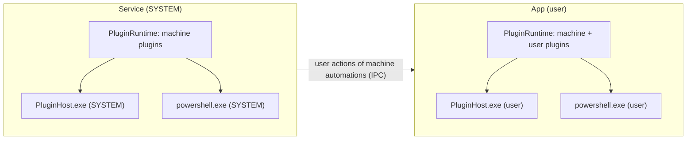

# Plugins architecture

This page is for people working on AutoSettings itself. To write a plugin, see [Plugins](../plugins/index.md).

## Parts

| Part | Project | Role |
|---|---|---|
| SDK | `AutoSettings.Sdk` | Public API for .NET plugins. It has no dependencies and does not reference Core. |
| Manifest | `Core/Plugins` | `PluginManifest`, the reader with line numbers, the validator, and `ManifestMapping` to catalog entries. |
| Store and installer | `Core/Plugins` | `PluginStore` finds installed plugins (`<root>\<id>\<version>`, `installed.json`). `PluginInstaller` installs, updates, rolls back and removes. `PluginPackage` handles `.aspkg` files. |
| Runtime | `Platform/Plugins/PluginRuntime` | Loads plugins and registers their handlers, builds the catalog, watches the folders, and runs triggers while automations use them. |
| Backends | `Platform/Plugins` | `ScriptBackend` (one PowerShell process per call, `ScriptRunner`) and `DotnetBackend` (one `PluginHost` process per plugin, `PluginHostClient`). |
| Host | `AutoSettings.PluginHost` | Loads one .NET plugin in a `PluginLoadContext` that shares only the SDK, and speaks `IPluginHostRpc` over stdin and stdout. |
| Management | `Platform/Plugins/PluginManager`, `Agent/Plugins/PluginCommands` | Installs from files or GitHub with checksum checks. Runs the `--plugin` command line, elevating itself for machine plugins. |
| UI | `Agent/MainWindow.Plugins.cs` | The Plugins page. |
| Tools | `AutoSettings.PluginTool`, `templates/` | `autosettings-plugin pack/validate/describe`, `dotnet new autosettings-plugin`. |
| Docs | `DocGen/ApiReferenceGenerator` | `docs/plugins/api` from the SDK's XML documentation. |

## Where plugins run

- The **service** loads machine plugins only, from folders that only administrators can change. It runs their
  `runs_as: machine` actions and their conditions. User actions in machine automations go to the user's app, like
  built-in user actions (`RoutingActionHandler`).
- The **app** loads machine plugins and the user's own plugins, and runs their user actions and conditions as the
  user.
- **Triggers** run where the automations that use them run: polling or watching starts when the loaded automations
  use a trigger of the plugin, and stops when they do not.

## The catalog

Built-in components are `ComponentCatalog.BuiltIn`. `PluginStore.Compose` adds the components of active plugins, with
machine plugins first, and leaves out a plugin whose types clash. The catalog is used for:

- validation;
- the editor's forms and YAML help;
- list summaries.

The service and the app read it from `IComponentCatalogProvider`. When the plugin folders change, the runtime reloads.
The new catalog goes to:

- `RuleEngine.UseCatalog`, which prepares the triggers again;
- `ConfigFileStore.UseCatalog`, which validates the file again.

An automation that uses a type of a missing plugin (shaped `publisher.plugin.name`) is kept with
`Automation.MissingPlugins` and does not run. See [Rule engine](engine.md#plugin-events-and-missing-plugins).

## Requests

Both backends describe a call the same way: the JSON built by `PluginRequest.Build`. It holds the operation, the
parameters (with defaults and placeholders applied), the event, the user, the snapshot and the state folder.

- Script plugins read it on standard input; the same values are also in `AUTOSETTINGS_*` environment variables.
- The plugin host turns it into `ActionRequest` and `ConditionRequest`.

Results: exit codes and output for scripts (`PluginOutput`), return values and exceptions for .NET.

## Failure handling

- Script calls and .NET calls have a timeout. A .NET host that does not answer is restarted.
- A .NET host that crashes is restarted when needed. After 3 crashes in 10 minutes the plugin stays off until the app
  restarts or the plugin changes.
- A plugin uninstalled while its host runs is marked `remove` in `installed.json`. It stops loading at once, and its
  files are deleted on the next load, after the hosts were stopped.

## Tests

- `tests/AutoSettings.Core.Tests`:
  - manifests, packages (including malicious zips), store and installer, protocol;
  - the SDK describer and the public API snapshot;
  - plugin triggers and missing plugins.
- `tests/AutoSettings.Platform.Tests` (Windows CI):
  - the script runner and the hello-script sample with real PowerShell;
  - the HelloDotnet sample through the real host, including crashes;
  - GitHub installs against a fake server.
